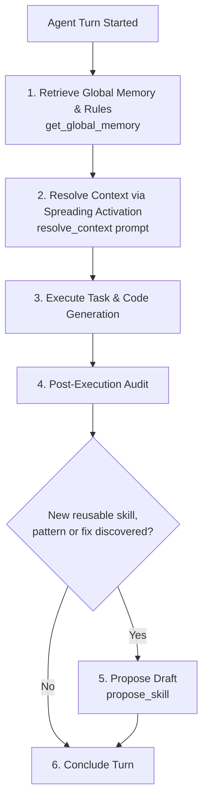

# HERMES CONTEXT ENGINE - AGENT DIRECTIVES & PROTOCOL

This repository is governed by the **Hermes Knowledge Hub (`~/.hermes-hub`)** and the **`hermes-context-engine` MCP Server**. All AI agents operating in this workspace MUST adhere to the following mandatory lifecycle protocol.

---

## 1. Mandatory Lifecycle Workflow

---

## 2. Inviolable Directives for Agents

### Phase A: Planning & Context Retrieval (MANDATORY)
1. **Before modifying any code or formulating an implementation plan**, the agent **MUST** call `hermes-context-engine:resolve_context(prompt=...)` with the core keywords/concepts of the user request.
2. The agent **MUST** incorporate the returned skills, architectural patterns, and antipattern mitigations into its solution design.
3. If working on cross-cutting concerns, the agent **MUST** consult `hermes-context-engine:get_global_memory()` to reinforce global developer preferences and rules.

### Phase B: Execution & Architectural Standards
- **TypeScript**: Strict mode, explicit types, discriminated unions. No `any`.
- **Next.js App Router**: Route handlers must specify runtime explicitly (`nodejs` for crypto/raw streams). Server Actions are strictly for data mutations.
- **Security & Secrets**: Never expose secrets without `NEXT_PUBLIC_` prefix. Guard server modules with `import "server-only"`.
- **Database & RLS**: PostgreSQL / Supabase tables MUST enforce Row Level Security (`auth.uid()`). All external data inputs MUST be parsed with Zod schemas.

### Phase C: Knowledge Capture & Self-Improvement (MANDATORY)
1. **Upon completing a task**, if the agent implemented a non-trivial solution, resolved a complex edge case, or discovered a reusable workflow:
   - The agent **MUST** call `hermes-context-engine:propose_skill(id, title, type, tags, procedure_markdown)`.
2. This creates a quarantined proposal in `~/.hermes-hub/drafts/draft-{id}.md` with `usage_count: 1` and `status: quarantined` for review and promotion.

---

## 3. MCP Tool Reference

| Tool | Purpose | When to Use |
| :--- | :--- | :--- |
| `get_global_memory()` | Fetches `USER.md` & `MEMORY.md` | Start of session or complex architectural tasks |
| `resolve_context(prompt, threshold, max_hops)` | Spreading Activation over knowledge graph | Planning phase before any coding |
| `propose_skill(id, title, type, tags, procedure_markdown)` | Quarantines a new draft skill | Post-task completion when reusable code is made |
| `validate_and_promote_skill(draft_id, related_nodes)` | Promotes draft to active hub & updates graph | Knowledge maintenance & verified reuse |
