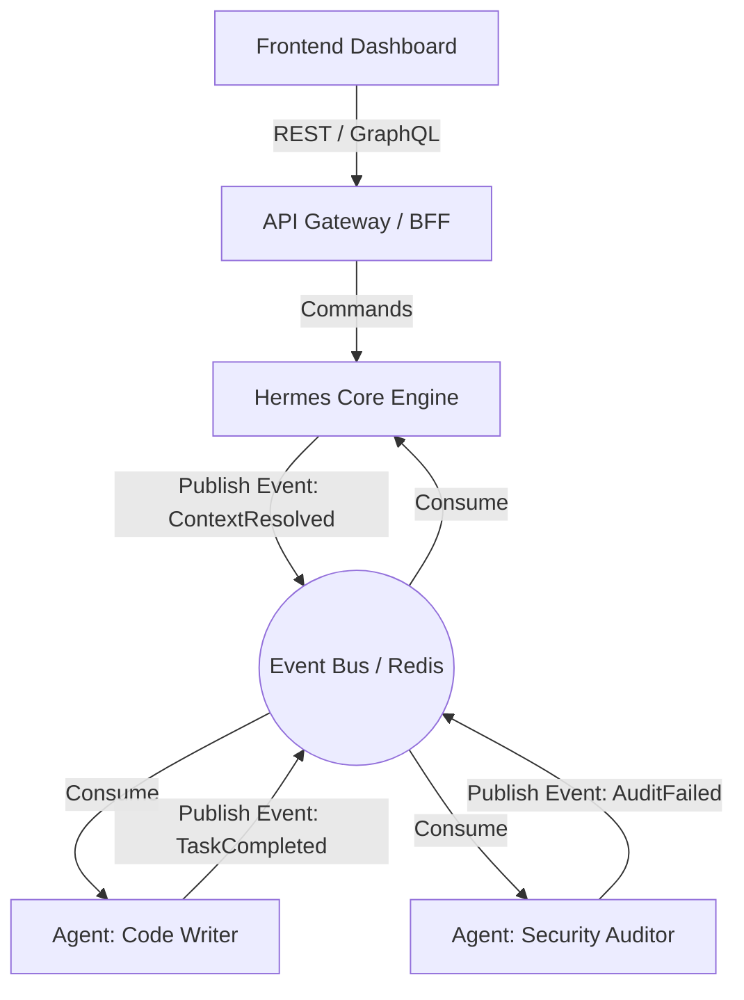

# Hermes Hub: Arquitectura Empresarial y Diseño de Sistemas Agénticos

Este documento constituye la especificación de arquitectura de más alto nivel para el ecosistema **Hermes Hub**. Está diseñado para equipos de ingeniería de plataforma y arquitectos de IA que buscan escalar el motor de contexto a un entorno de producción de alta disponibilidad, tolerante a fallos y con procesamiento masivo de datos mediante Agentes Autónomos.

---

## 1. Arquitectura y Patrones de Diseño

El núcleo de Hermes Hub no es un monolito estático, sino un ecosistema dinámico diseñado para la asincronía y el aprendizaje continuo. Para lograr esto a escala empresarial, implementamos una topología basada en los siguientes patrones.

### 1.1 Arquitectura Basada en Eventos (Event-Driven Architecture / Pub-Sub)
En un entorno multi-agente, la comunicación síncrona HTTP entre agentes genera cuellos de botella (bloqueos por latencia de inferencia de LLMs). Implementamos un modelo de eventos asíncronos utilizando **Redis Streams** o **Apache Kafka**.



**Flujo Técnico:**
1. El usuario envía un prompt.
2. El API publica un evento `ActionRequested`.
3. El motor Hermes Core realiza la *Propagación de Activación* (Spreading Activation) y publica el evento `ContextResolved` con los vectores y el contexto semántico inyectado.
4. Los subagentes suscritos al tópico consumen este contexto y operan independientemente, emitiendo resultados de vuelta al bus.

### 1.2 Arquitectura Microkernel (Arquitectura de Plugins)
El motor principal (Microkernel) contiene únicamente la lógica de enrutamiento, la gestión de la memoria RAM y el cargador de plugins. Todas las herramientas (MCP), habilidades (skills) y conectores a bases de datos vectoriales son *plugins* independientes.
* **Core:** Spreading Activation, Hebbian Plasticity, Event Routing.
* **Plugins (Skills):** `search_web`, `run_sql`, `propose_skill`.

### 1.3 Patrones de Resiliencia y Escalabilidad

Dado que dependemos de modelos de lenguaje externos (Gemini, Claude) y bases de datos intensivas (pgvector), las fallas de red y el rate limiting son garantizadas.

#### A. Circuit Breaker (Cortacircuitos) para Inferencia de LLM
Si la API del LLM falla o tarda demasiado, en lugar de saturar el sistema con reintentos ciegos, el circuito se "abre" y lanza errores instantáneos (Fast Fail) o utiliza un modelo de respaldo local (Fallback).

```python
# Ejemplo de implementación con la librería 'pybreaker'
import pybreaker
import requests

# Permitir 5 fallos consecutivos antes de abrir el circuito.
# Reintentar estado "Half-Open" después de 60 segundos.
llm_breaker = pybreaker.CircuitBreaker(fail_max=5, reset_timeout=60)

@llm_breaker
def call_gemini_api(prompt: str, context: dict):
    response = requests.post("https://generativelanguage.googleapis.com/v1beta/models/gemini-1.5-pro:generateContent", json={...})
    response.raise_for_status()
    return response.json()
```

#### B. Rate Limiting Distribuido (Token Bucket)
Para proteger la base de datos de PostgreSQL (Supabase) de ráfagas masivas durante la ingesta de conocimiento, implementamos un Token Bucket en Redis.

```typescript
// Next.js Edge Middleware con @upstash/ratelimit
import { Ratelimit } from "@upstash/ratelimit";
import { Redis } from "@upstash/redis";

const ratelimit = new Ratelimit({
  redis: Redis.fromEnv(),
  limiter: Ratelimit.tokenBucket(100, "10 s", 100), // 100 tokens, rellena 100 cada 10s
});

export async function middleware(req: NextRequest) {
  const ip = req.ip || "127.0.0.1";
  const { success } = await ratelimit.limit(`ratelimit_${ip}`);
  if (!success) return new Response("Too Many Requests", { status: 429 });
}
```

---

## 2. Antipatrones Críticos y Soluciones

El diseño de agentes autónomos es propenso a severos antipatrones que degradan el performance y destruyen el presupuesto de tokens.

### 2.1 El "God Agent" (Agente Monolítico)
* **Síntoma:** Un solo agente tiene acceso a 50 herramientas y un prompt de sistema de 10,000 tokens que le dice cómo hacer de todo (programar, analizar datos, escribir correos).
* **Riesgo:** Confusión del modelo, alucinaciones, incapacidad para seguir instrucciones complejas y gasto masivo de tokens por cada iteración.
* **Refactorización:** Implementar **Routing Agents**. El agente principal solo tiene 1 herramienta: `transfer_to_agent`. Delega la tarea al `Database_Agent` o al `UI_Agent`, quienes tienen prompts cortos y especializados.

### 2.2 Context Overflow (Inyección de Contexto Basura)
* **Síntoma:** Al buscar una respuesta, el sistema inyecta en el prompt 20 archivos completos usando RAG clásico, llenando la ventana de contexto.
* **Riesgo:** "Lost in the middle" (el LLM ignora la información en el centro del prompt) y latencia altísima.
* **Refactorización:** **Spreading Activation con Poda Semántica**. Hermes Hub primero extrae solo el grafo de conocimiento, y pide al LLM los fragmentos exactos que necesita. Se envían solo los *summaries* y, si el LLM lo requiere explícitamente, hace una llamada a la API `/api/file` para leer el archivo completo.

### 2.3 Infinite Loop Execution
* **Síntoma:** El agente falla al usar una herramienta, recibe el error, y vuelve a intentar el mismo comando idéntico 100 veces seguidas en un bucle infinito.
* **Riesgo:** Consumo masivo de API e interrupción total del servicio.
* **Refactorización:** Inyectar el hash de estado. Si el estado del error no cambia en 3 iteraciones, forzar un `HumanInTheLoopException` o matar el thread del agente por *Timeout Exceeded*.

### 2.4 State Mutation Anomalies (Estado Mutable Global)
* **Síntoma:** Múltiples agentes acceden y editan el mismo `graph.json` simultáneamente, corrompiendo los enlaces sinápticos.
* **Riesgo:** Pérdida de integridad de datos y condición de carrera (Race Conditions).
* **Refactorización:** **Event Sourcing**. Nadie edita el grafo directamente. Los agentes emiten eventos inmutables `EdgeWeightIncreasedEvent`. Un único servicio encolador (Worker) procesa los eventos secuencialmente en PostgreSQL usando bloqueos transaccionales (ACID).

---

## 3. Matriz de Skills y Capacidades (Registro MCP)

Esta es la matriz de herramientas fundacionales que el Motor Hermes expone a los agentes de IA a través del Model Context Protocol (MCP).

| Identificador de Skill | Categoría | Dependencias | Lógica de Orquestación Interna |
| :--- | :--- | :--- | :--- |
| `resolve_context` | Cognitiva (Lectura) | Supabase/pgvector, Redis | 1. Vectoriza el query. 2. Busca los 10 nodos base. 3. Aplica Spreading Activation por 2 saltos. 4. Devuelve nodos ordenados por energía. |
| `propose_skill` | Memoria (Escritura) | Filesystem (`~/.hermes-hub`) | 1. Valida el Markdown/Zod. 2. Lo guarda en `/drafts`. 3. Emite evento `SkillProposed` para auditoría humana. |
| `validate_and_promote`| Gobernanza | Git CLI | 1. Mueve el archivo de `/drafts` a `/skills`. 2. Crea commit en Git. 3. Actualiza vector embeddings. 4. Dispara push remoto. |
| `activate_plasticity` | Optimización | Neo4j / NetworkX | 1. Recibe array de Nodos usados juntos. 2. Incrementa peso de las aristas en +0.1. 3. Si peso > 1.0, lo acota. |
| `search_web` | I/O Externa | SerpAPI / Tavily | 1. Usa la API externa. 2. Limpia el HTML. 3. Transforma a Markdown. 4. Retorna snippet enriquecido. |

---

## 4. Catálogo de APIs Públicas y de Integración

Hermes Hub provee una interfaz REST/gRPC para conectarse con frontends (como nuestro Dashboard en Next.js) y sistemas de terceros.

### 4.1 Autenticación Estándar
Para la capa humana (Dashboard), usamos **JWT (JSON Web Tokens)** a través de Supabase Auth.
Para la capa de comunicación Server-to-Server (Agentes externos conectándose al motor), usamos **mTLS (Mutual TLS)** o ApiKeys rotativas pasadas vía el header `x-hermes-api-key`.

### 4.2 APIs Esenciales

#### `POST /api/v1/context/resolve`
* **Caso de uso:** Solicitar al cerebro que extraiga contexto semántico para un prompt específico.
* **Auth:** Obligatorio (JWT / API Key).
* **Payload:**
  ```json
  {
    "prompt": "Cómo configuro Row Level Security en Supabase?",
    "threshold": 0.75,
    "max_hops": 2,
    "auto_reinforce": true
  }
  ```
* **Límites:** 50 requests / minuto por IP.

#### `POST /api/v1/memory/episodic`
* **Caso de uso:** Guardar una conversación o un log de ejecución de agente en la memoria a corto plazo del Hub.
* **Auth:** Obligatorio (Server-to-Server).
* **Payload:**
  ```json
  {
    "session_id": "uuid-1234",
    "agent_id": "auditor-01",
    "trajectory_summary": "El agente encontró 3 fallos XSS y generó un reporte."
  }
  ```

#### `GET /api/v1/graph/topology`
* **Caso de uso:** Descargar la estructura topológica del grafo (nodos y aristas) para el renderizador web 3D.
* **Auth:** Obligatorio.
* **Query Params:** `?limit=5000&include_orphans=false`

---

## 5. Estructuras de Datos y Modelado (Contratos Tipados)

Todo el ecosistema de Hermes Hub debe basarse fuertemente en tipado estricto para evitar alucinaciones por parte del LLM. Utilizamos **Zod** para validación en Runtime.

### 5.1 Hermes Node (Esquema Central de Conocimiento)

```typescript
import { z } from 'zod';

export const HermesNodeSchema = z.object({
  id: z.string().uuid(),
  label: z.string().min(3).max(120),
  type: z.enum(["skill", "rule", "architecture", "memory", "agent"]),
  category_id: z.string().optional(),
  tags: z.array(z.string()).max(10),
  summary: z.string().max(1000),
  content_source_file: z.string().regex(/\.md$/),
  metadata: z.object({
    created_at: z.string().datetime(),
    last_accessed: z.string().datetime(),
    usage_count: z.number().int().min(0).default(0),
    energy_baseline: z.number().min(0).max(1).default(0.1) // Para Hebbian Plasticity
  })
});

export type HermesNode = z.infer<typeof HermesNodeSchema>;
```

### 5.2 Synaptic Edge (Relaciones Neuronales)

```typescript
export const SynapticEdgeSchema = z.object({
  source_node_id: z.string().uuid(),
  target_node_id: z.string().uuid(),
  relationship_type: z.enum([
    "requires", 
    "implements", 
    "mitigates", 
    "related_concept", 
    "pairs_with"
  ]),
  weight: z.number().min(0.0).max(1.0).default(0.5),
  last_reinforced: z.string().datetime().optional()
});

export type SynapticEdge = z.infer<typeof SynapticEdgeSchema>;
```

### 5.3 Evento de Bus del Agente (Pub/Sub Envelope)

```typescript
export const AgentEventEnvelopeSchema = z.object({
  event_id: z.string().uuid(),
  timestamp: z.string().datetime(),
  event_type: z.string(), // ej. "CodeGenerationCompleted"
  source_agent: z.string(),
  correlation_id: z.string().uuid(), // Para trazar la petición original del usuario
  payload: z.record(z.any()), // JSON libre dependiendo del event_type
});
```

---
*Fin del Documento de Diseño Arquitectónico.*
